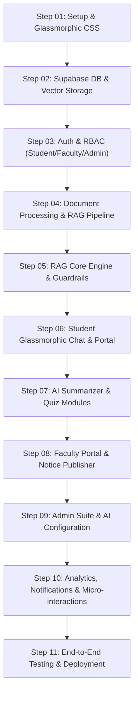

# CampusNova AI — Master Prompts & Development Step Pipeline

Welcome to the **Master Prompts Guide** for building **CampusNova AI** — an AI-Powered College Knowledge Assistant utilizing Retrieval-Augmented Generation (RAG), built with FastAPI, Next.js, Supabase, Pinecone, and OpenAI.

This suite provides 11 step-by-step master execution prompts. Each prompt is self-contained, highly specific, and optimized to produce production-grade, state-of-the-art code featuring a **unique Glassmorphic UI/UX design system**.

---

## 🗺️ Master Pipeline Map

---

## 📂 Steps Overview

| File | Step Name | Description | Key Tech / UI Focus |
| :--- | :--- | :--- | :--- |
| [`01_Project_Setup_and_Glassmorphic_Design.md`](file:///C:/Users/B%20himavarsha/OneDrive/Documents/project3/prompts/01_Project_Setup_and_Glassmorphic_Design.md) | Project Setup & Design System | Monorepo structure setup, FastAPI & Next.js config, Glassmorphic CSS design tokens & base layout. | Next.js 14+, FastAPI, Tailwind/CSS variables, Frosted glass tokens |
| [`02_Database_Design_and_Supabase.md`](file:///C:/Users/B%20himavarsha/OneDrive/Documents/project3/prompts/02_Database_Design_and_Supabase.md) | Database Schema & Vectors | Supabase PostgreSQL tables, RLS security policies, triggers, and Pinecone vector index mapping. | Supabase, PostgreSQL, RLS, Pinecone Vector DB |
| [`03_Auth_and_Role_Based_Access_Control.md`](file:///C:/Users/B%20himavarsha/OneDrive/Documents/project3/prompts/03_Auth_and_Role_Based_Access_Control.md) | Auth & Role-Based Routing | JWT authentication, Supabase Auth integration, RBAC middleware, and Glassmorphic Auth UI. | FastAPI OAuth2, Supabase Auth, Next.js Middleware |
| [`04_Document_Processing_and_RAG_Ingestion.md`](file:///C:/Users/B%20himavarsha/OneDrive/Documents/project3/prompts/04_Document_Processing_and_RAG_Ingestion.md) | Document Processing & Chunking | PDF/DOCX/TXT/CSV text extraction, metadata-aware chunking, Hugging Face embeddings, Pinecone upsert. | PyPDF/Docx/Pandas, Hugging Face sentence-transformers, Pinecone |
| [`05_AI_RAG_Core_Engine_and_Guardrails.md`](file:///C:/Users/B%20himavarsha/OneDrive/Documents/project3/prompts/05_AI_RAG_Core_Engine_and_Guardrails.md) | RAG Engine & Citation Guardrails | Semantic similarity search, groundness verification, citation generator, anti-hallucination prompts. | LangChain/OpenAI, Pinecone Top-K, Custom System Prompts |
| [`06_Student_Glassmorphic_Dashboard_and_Chat.md`](file:///C:/Users/B%20himavarsha/OneDrive/Documents/project3/prompts/06_Student_Glassmorphic_Dashboard_and_Chat.md) | Student Hub & AI Chat | Glassmorphic student portal, streaming AI chat interface, citation modal, message history, prompt pills. | React Streaming, Glassmorphism UI, Framer Motion |
| [`07_AI_Summarizer_and_Quiz_Generator.md`](file:///C:/Users/B%20himavarsha/OneDrive/Documents/project3/prompts/07_AI_Summarizer_and_Quiz_Generator.md) | AI Summarizer & Quiz Suite | Document summarizer tool, AI quiz generator with difficulty tiers, interactive scoring, answer explanations. | OpenAI GPT-4o-mini, Interactive Glass Cards |
| [`08_Faculty_Portal_and_Notice_Management.md`](file:///C:/Users/B%20himavarsha/OneDrive/Documents/project3/prompts/08_Faculty_Portal_and_Notice_Management.md) | Faculty Workspace & Notices | Document upload dropzone, versioning UI, notice publisher with expiry, unanswered student query manager. | Dropzone, Glassmorphic Dashboard, Notice Feed |
| [`09_Admin_Portal_and_AI_Config.md`](file:///C:/Users/B%20himavarsha/OneDrive/Documents/project3/prompts/09_Admin_Portal_and_AI_Config.md) | Admin Suite & AI Parameter Control | User & department management, vector index rebuild tools, AI hyperparameter slider UI, system audit logs. | Admin Dashboard, Glass Controls, System Telemetry |
| [`10_Analytics_Notifications_and_Glassmorphic_Polish.md`](file:///C:/Users/B%20himavarsha/OneDrive/Documents/project3/prompts/10_Analytics_Notifications_and_Glassmorphic_Polish.md) | Telemetry & Micro-Interactions | Real-time notification center, platform usage charts, response time analytics, UI ambient polish. | Chart.js/Recharts, Toast Alerts, Micro-animations |
| [`11_Testing_QA_and_Deployment.md`](file:///C:/Users/B%20himavarsha/OneDrive/Documents/project3/prompts/11_Testing_QA_and_Deployment.md) | Testing & Production Setup | Pytest API suite, Jest UI component tests, Vercel & Railway deployment configurations, environment sanity checks. | Pytest, Jest, Docker, Vercel/Railway CI/CD |

---

## 🎨 Glassmorphic Design System Guidelines

All frontend steps mandate the implementation of our unified **Glassmorphic UI/UX Design Token System**:
- **Base Environment**: Deep dark ambient mesh canvas (`#090D16` slate dark with radial glows of indigo `#6366F1` and cyan `#06B6D4`).
- **Frosted Panels**: Background `rgba(15, 23, 42, 0.65)` with `backdrop-filter: blur(16px)` and border `1px solid rgba(255, 255, 255, 0.12)`.
- **Glow & Highlights**: Inner box-shadow `inset 0 1px 1px rgba(255, 255, 255, 0.15)` and outer accent glow on focus/hover (`0 0 25px rgba(99, 102, 241, 0.35)`).
- **Typography**: Google Font **Outfit** for headers & **Inter** for clean readable body text.
- **Interactivity**: Smooth spring physics, floating glass cards, subtle neon pill badges, and shimmer skeleton loaders.

---

## 🚀 How to Execute These Steps

1. Execute steps sequentially from **Step 01** to **Step 11**.
2. Each step file provides:
   - **What We Did Up To Now**: Full context of preceding milestones.
   - **Step Prompt**: The copy-pasteable master prompt.
   - **Expected Output**: Deliverables, code modules, and structural outputs.
   - **Step Connectivity**: Explicit input requirements from previous steps and outputs passed to future steps.
